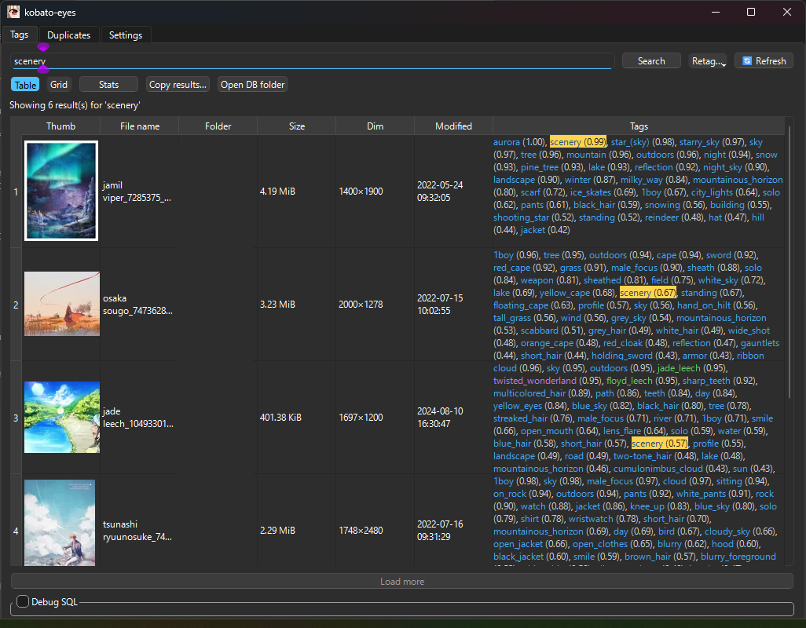

# kobato-eyes

**kobato-eyes** は、ローカル PC 上の画像に Danbooru タグを自動付与し、類似画像検出と検索を行う Windows 向けデスクトップアプリケーションです。PyQt6 を用いた GUI と SQLite + FTS5 データベースを組み合わせ、スキャンからタグ付け、検索、重複チェックまでを一貫して実行します。

# Quick Setup
- [リリースページ](https://github.com/srndpty/kobato-eyes/releases)から最新版の7zをDL→展開
- kobato-eyes.exeを起動
- settingsタブのrootsに、danbooruタグを付けたい画像があるフォルダを指定
- taggerモデルを指定
- PixAIの場合
  - [deepghs/pixai-tagger-v0.9-onnx](https://huggingface.co/deepghs/pixai-tagger-v0.9-onnx/tree/main) から model.onnxとselected_tags.csv、preprocess.jsonの **3ファイル** をDLし、同じフォルダに置く
  - settingsタブからtaggerをwd14-onnxに指定し、modelでmodel.onnxを指定
- WD14の場合
  - [SmilingWolf/wd-swinv2-tagger-v3](https://huggingface.co/SmilingWolf/wd-swinv2-tagger-v3/tree/main) などからmodel.onnxとselected_tags.csvをDLし、同じフォルダに置く
  - settingsタブからtaggerをwd14-onnxに指定し、modelでmodel.onnxを指定
- （tagsタブ→Open DB folderでdbフォルダを開き、そこに新しいフォルダを作ってそこに置くのがおすすめ）
- tagsタブでIndex Nowボタンを押す
- タグ付けはNVIDIA GPU推奨。settingsタブでVRAMに応じてbatch size設定
- pixaiのほうが対応タグ数が多く（wd:8000, pixai:13000）、作品名タグにも対応しているので、基本的にpixai推奨
- パフォーマンス（RTX4090、画像7万枚、バッチサイズ32）

| tagger |   必要VRAM | 想定所要時間 |
|:---|:---:|:---:|
| wd tagger |  13 GB | 約30分 |
| pixai tagger |   20 GB | 約2時間 |

- 検索はSQL-like（空白区切りでAND検索、ORとNOTが使用可能）

(以降のドキュメントはAI生成)

## 主な機能

- **タグ付けパイプライン**: 監視対象ディレクトリをスキャンし、ONNX Runtime (WD14 / PixAI) で画像に Danbooru タグを推論。閾値や最大タグ数はプロバイダーごとに調整可能です。
- **重複検出**: pHash による候補抽出と SSIM / ORB による最終判定で近似重複を抽出し、UI 上でクラスタごとに整理・破棄操作が可能です。
- **検索 UI**: タグ検索・オートコンプリート・統計表示・重複レビューなどを備えたタブ UI。設定タブから監視ルートやモデルパス、閾値を編集できます。
- **堅牢なデータ管理**: SQLite (WAL / 外部キー ON) に画像メタ情報とタグを格納し、FTS5 で高速全文検索を提供。AppData 配下にデータ・ログ・インデックスを自動作成します。
- **拡張性**: core/、ui/、tagger/、dup/、sig/ などモジュール分割済みで、カスタムタグガーやステージを容易に追加可能です。

## プロジェクト構成

```
src/
├─ core/        # パイプライン、設定、ジョブ管理
├─ db/          # SQLite スキーマとリポジトリ
├─ dup/         # 重複検出ロジック
├─ index/       # ベクトル検索モジュール（将来的な拡張用スタブ）
├─ sig/         # 画像署名と特徴量計算
├─ tagger/      # ONNX タガー実装 (WD14 / PixAI / ダミー)
├─ ui/          # PyQt6 GUI、ViewModel、ウィジェット
└─ utils/       # 共通ユーティリティ
```

`tests/` にはパイプライン・DB・ユーティリティ向けの自動テストが配置されています。

## 前提条件

- Windows 10 以降を想定 (開発環境は他 OS でも可)
- Python 3.10 以上
- CUDA 対応 GPU (onnxruntime-gpu 使用時。CPU 版に差し替える場合は `onnxruntime` を利用)
- Visual C++ 再頒布可能パッケージ / GPU ドライバ等の依存関係

## セットアップ

```powershell
git clone https://github.com/srndpty/kobato-eyes.git
cd kobato-eyes
python -m venv .venv
.venv\Scripts\activate
python -m pip install --upgrade pip
pip install -e .[dev]
pre-commit install
```

### モデルファイルの配置

1. WD14 または PixAI の ONNX モデルと `tags.csv` をダウンロード
2. 任意のディレクトリに保存 (`models/` など)
3. 初回起動後に作成される設定タブまたは `config.yaml` でパスを指定

## 実行方法

```powershell
.venv\Scripts\activate
python -m ui.app
```

初回起動時にはスプラッシュ画面でデータベースを初期化し、設定タブから監視ルートを登録します。設定は `%APPDATA%\kobato-eyes\config.yaml` に保存され、データベース・インデックス・ログは同ディレクトリ配下に作成されます。

### ヘッドレス環境

CI などで GUI を起動しない場合は、環境変数 `KOE_HEADLESS=1` を指定すると Qt の初期化を回避します。

## 設定とカスタマイズ

- **config.yaml**: 監視ルート (`roots`)、除外パス (`excluded`)、拡張子フィルター (`allow_exts`)、バッチサイズ、重複閾値 (`hamming_threshold` / `ssim_threshold`)、タガー設定などを定義。
- **環境変数**:
  - `KOE_DATA_DIR` — デフォルトの AppData 以外にデータディレクトリを変更
  - `KOE_LOG_LEVEL` — `DEBUG`/`INFO` などログレベル指定
  - `KOE_HEADLESS` — ヘッドレスモード切り替え

## データベースとインデックス

- SQLite3 + WAL モードで DB を保存し、`fts_images` テーブルで FTS5 を利用します。
- 将来的にベクトル近傍探索を格納するための `index/` ディレクトリを用意しています。
- ログは `%APPDATA%\kobato-eyes\logs\app.log` にローテーション出力されます。

## テスト

- ヘッドレスでユニットテスト: `KOE_HEADLESS=1 PYTHONPATH=src pytest`
- GUI / 統合テストを含めて実行: `PYTHONPATH=src pytest -m "gui or integration"`

## パッケージング

1. 開発依存をインストール: `pip install -e .[dev]`
2. Windows バイナリを生成: `pyinstaller tools/kobato-eyes.spec`
3. `dist/kobato-eyes/` に成果物が出力されます
4. 実行前に `onnxruntime-gpu` とモデルファイルを同梱してください

## トラブルシューティング

- モデルが見つからない場合は設定タブまたは `config.yaml` のパスを再確認してください。
- GPU が無い環境では `pip uninstall onnxruntime-gpu` の後に `pip install onnxruntime` へ切替えることで CPU 実行が可能です。
- データディレクトリを移動したい場合は `KOE_DATA_DIR` を設定した上で再起動すると自動移行が行われます。

# License

MIT.