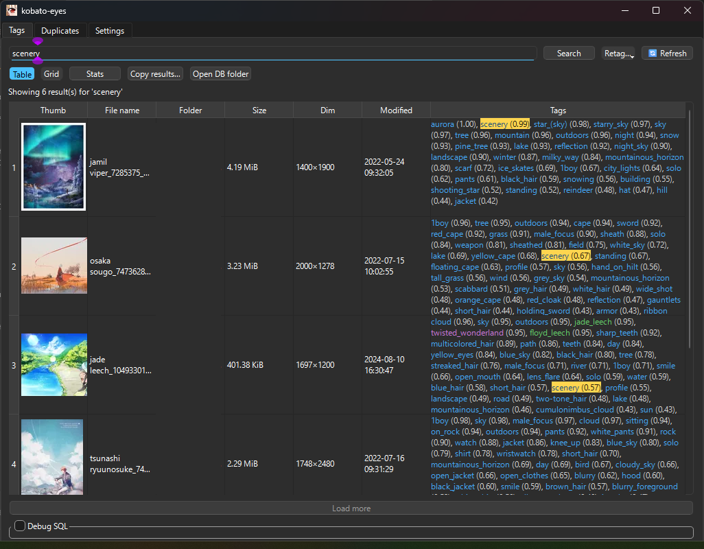

# kobato-eyes



**kobato-eyes** は、ローカル PC 上の画像に Danbooru タグを自動付与し、類似画像検出と検索を行う Windows 向けデスクトップアプリケーションです。PyQt6 を用いた GUI と SQLite + FTS5 データベースを組み合わせ、スキャンからタグ付け、検索、重複チェックまでを一貫して実行します。

# Quick Setup
- [リリースページ](https://github.com/srndpty/kobato-eyes/releases)から最新版の 7z または zip をDL→展開
- kobato-eyes.exeを起動
- settingsタブのrootsに、danbooruタグを付けたい画像があるフォルダを指定
- taggerモデルを指定（tagsタブ→Open DB folderでdbフォルダを開き、そこにモデル用フォルダを作って置くのがおすすめ）
- PixAIの場合
  - [deepghs/pixai-tagger-v0.9-onnx](https://huggingface.co/deepghs/pixai-tagger-v0.9-onnx/tree/main) から model.onnxとselected_tags.csv、preprocess.jsonの **3ファイル** をDLし、同じフォルダに置く
  - settingsタブではtaggerをwd14-onnxに指定し、modelでmodel.onnxを指定する
  - PixAI / WD14 の判定は selected_tags.csv から自動判定される
- WD14の場合
  - [SmilingWolf/wd-swinv2-tagger-v3](https://huggingface.co/SmilingWolf/wd-swinv2-tagger-v3/tree/main) などからmodel.onnxとselected_tags.csvをDLし、同じフォルダに置く
  - settingsタブからtaggerをwd14-onnxに指定し、modelでmodel.onnxを指定

## Instant Usage
- tagsタブでIndex Nowボタンを押す
  - タグ付けはNVIDIA GPU推奨。settingsタブでVRAMに応じてbatch size設定可
- pixaiのほうが対応タグ数が多く（wd:8000, pixai:13000）、作品名タグにも対応しているので、基本的にpixai推奨
- パフォーマンス（RTX4090、画像7万枚、バッチサイズ32の場合）

| tagger |   VRAM | 想定所要時間 |
|:---|:---:|:---:|
| wd tagger |  13 GB | 約20分 |
| pixai tagger |   20 GB | 約50分 |

- 検索はSQL-like（空白区切りでAND検索、空白で区切った | か OR でOR検索、-かNOTで除外検索が使用可能）
- statsボタンで付けたタグの統計情報表示
- Copy resultsで検索にヒットした画像を新規別フォルダにコピー
- フォルダの中身が変わったら🔄refreshボタンで新規・削除画像を検出してデータ更新
- duplicatesタブは同じsettingsタブのrootsが対象
- hamming, max_bitsは数字を小さくするとわずかな違いで別画像と判定するようになり、大きくすると差異が多くても重複と判定するようになる (smaller is stricter)
- gridは逆に、数字を大きくすると厳格に、小さくするとゆるく重複判定 (bigger is stricter)

## 既知の制限
- キャラ名の誤検出が多い（taggerモデルの限界のため。モデル側のアップグレードにより改善の可能性あり）

## 開発に参加する

このプロジェクトに貢献したい方は、以下を参照してください：

- **[CLAUDE.md](CLAUDE.md)** — 開発者向けの統一的なガイド（環境構築、コード規約、モジュール構成、テスト方針）
- **[AGENTS.md](AGENTS.md)** — 実装エージェント向けの詳細な指針
- **[docs/architecture.md](docs/architecture.md)** — システムアーキテクチャとデータフロー図

### クイックスタート（開発環境）

```powershell
# 環境構築
python -m venv .venv
.\.venv\Scripts\Activate.ps1
python -m pip install --upgrade pip
python -m pip install -c requirements-dev.lock -e ".[dev,tagging-cpu]"

$env:PYTHONPATH = "src"
$env:KOE_HEADLESS = "1"
pytest -q                            # 高速な単体テスト
.\scripts\check.ps1                  # 標準チェック（コード品質 + テスト）
```

## 主な機能

- **タグ付けパイプライン**: 監視対象ディレクトリをスキャンし、ONNX Runtime (WD14 / PixAI) で画像に Danbooru タグを推論。閾値や最大タグ数はプロバイダーごとに調整可能です。
- **重複検出**: pHash による候補抽出と SSIM / ORB による最終判定で近似重複を抽出し、UI 上でクラスタごとに整理・破棄操作が可能です。
- **検索 UI**: タグ検索・オートコンプリート・統計表示・重複レビューなどを備えたタブ UI。設定タブから監視ルートやモデルパス、閾値を編集できます。
- **堅牢なデータ管理**: SQLite (WAL / 外部キー ON) に画像メタ情報とタグを格納し、FTS5 で高速全文検索を提供。AppData 配下にデータ・ログ・インデックスを自動作成します。
- **拡張性**: core/、ui/、tagger/、dup/、sig/ などモジュール分割済みで、カスタムタグガーやステージを追加しやすい構成です。

## プロジェクト構成

```
src/
├─ core/        # パイプライン、設定、ジョブ管理
├─ db/          # SQLite スキーマとリポジトリ
├─ dup/         # 重複検出ロジック
├─ index/       # ベクトル検索モジュール（将来的な拡張用）
├─ sig/         # 画像署名と特徴量計算
├─ tagger/      # ONNX タガー実装 (WD14 / PixAI / ダミー)
├─ ui/          # PyQt6 GUI、ViewModel、ウィジェット
└─ utils/       # 共通ユーティリティ
```

`tests/` にはパイプライン・DB・UI helper・ユーティリティ向けの自動テストが配置されています。

## 前提条件

- Windows 10 以降を想定 (開発環境は他 OS でも可)
- Python 3.10.x（3.11 以降への広範囲対応は将来対応）
- CUDA 対応 GPU (onnxruntime-gpu 使用時。CPU 版に差し替える場合は `onnxruntime` を利用)
- Visual C++ 再頒布可能パッケージ / GPU ドライバ等の依存関係

## セットアップ

```powershell
git clone https://github.com/srndpty/kobato-eyes.git
cd kobato-eyes
python -m venv .venv
.venv\Scripts\activate
python --version  # Python 3.10.x であることを確認
python -m pip install --upgrade pip
python -m pip install -c requirements-dev.lock -e ".[dev,tagging-cpu]"
pre-commit install
```

GPU で ONNX タガーを実行する開発環境では、CPU 版の代わりに `python -m pip install -c requirements-dev.lock -e ".[dev,tagging-gpu]"` を使用してください。CLIP / hnswlib のベクトル検索は後続機能で、現状の `src/index/` は未使用 stub です。依存関係の事前検証を行う場合のみ `vector` extra を追加します。

### モデルファイルの配置

1. WD14 または PixAI の ONNX モデルと `selected_tags.csv` をダウンロード
2. 任意のディレクトリに保存 (`models/` など)
3. 初回起動後に作成される設定タブまたは `config.yaml` でパスを指定

## 実行方法

```powershell
.venv\Scripts\activate
python -m ui.app
```

初回起動時にはスプラッシュ画面でデータベースを初期化し、設定タブから監視ルートを登録します。設定は `%APPDATA%\kobato-eyes\config.yaml` に保存され、データベース・インデックス・ログは同ディレクトリ配下に作成されます。

### ヘッドレス環境

CI などで GUI を起動しない場合は、環境変数 `KOE_HEADLESS=1` を指定すると Qt の初期化を回避します。

## 設定とカスタマイズ

- **config.yaml**: 監視ルート (`roots`)、除外パス (`excluded`)、拡張子フィルター (`allow_exts`)、バッチサイズ、重複閾値 (`hamming_threshold` / `ssim_threshold`)、タガー設定などを定義。
- **環境変数**:
  - `KOE_DATA_DIR` — デフォルトの AppData 以外にデータディレクトリを変更
  - `KOE_LOG_LEVEL` — `DEBUG`/`INFO` などログレベル指定
  - `KOE_HEADLESS` — ヘッドレスモード切り替え

## データベースとインデックス

- SQLite3 + WAL モードで DB を保存し、`fts_images` テーブルで FTS5 を利用します。
- `src/index/` は後続の CLIP / hnswlib ベクトル近傍探索用の未使用 stub です。現行リリースの検索と重複検出は SQLite / FTS5 / pHash / SSIM / ORB 経路で動作します。
- ログは `%APPDATA%\kobato-eyes\logs\app.log` にローテーション出力されます。

## テスト / CI

CI は GitHub Actions 上の Windows + Python 3.10 で実行し、ローカル開発と同じ `requirements-dev.lock` を pip constraints として参照します。通常の高速確認は GUI / integration / db_stress / gpu を除外する `.\scripts\check.ps1` を使います。

```powershell
.\scripts\check.ps1
```

変更内容に応じて、以下の追加チェックを使います。

```powershell
.\scripts\check-gui-smoke.ps1        # PyQt6 / worker / GUI 状態変更
.\scripts\check-integration.ps1      # pipeline / DB bootstrap / end-to-end
.\scripts\check-db-stress.ps1        # SQLite lock / WAL / checkpoint / quiesce
.\scripts\check-package-smoke.ps1    # import 構造 / tools / packaging
.\scripts\check-gpu.ps1              # ONNX Runtime CUDA / GPU smoke
```

pre-commit と CI の整形差分を避けるため、Ruff は `pyproject.toml` と `.pre-commit-config.yaml` のバージョン・ターゲットを揃えています。

## パッケージング

1. Python 3.10.x の環境でリリース作成用依存をインストール: `python -m pip install -c requirements-dev.lock -e ".[dev,tagging-gpu,packaging]"`
2. リリース用バイナリと 7z を生成: `.\scripts\package-release.ps1 -Version v0.6 -Clean`
3. `dist\release\kobato-eyes-v0.6-win-x64.7z` と `dist\release\SHA256SUMS.txt` が出力されます
4. Windows 標準展開用の zip も作る場合: `.\scripts\package-release.ps1 -Version v0.6 -Clean -Zip`
5. モデルファイルは同梱せず、利用者が Quick Setup の手順で配置します

`package-release.ps1` は PyInstaller と 7-Zip (`7z` または `7zz`) を使用します。PyInstaller は `packaging` extra で導入されます。7-Zip は事前にインストールし、PATH または標準インストール先から見つかる状態にしてください。

## トラブルシューティング

- モデルが見つからない場合は設定タブまたは `config.yaml` のパスを再確認してください。
- GPU が無い環境では `tagging-cpu` extra、CUDA 対応環境では `tagging-gpu` extra を使って ONNX Runtime を選択してください。
- データディレクトリを移動したい場合は `KOE_DATA_DIR` を設定した上で再起動すると自動移行が行われます。

# License

MIT.
